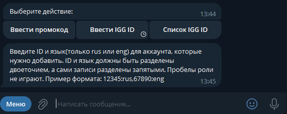
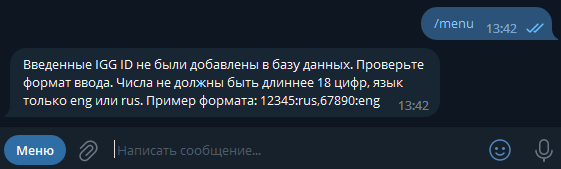

# Code redeemer for mobile game "Time Princess"


## Что умеет

.....

## Список команд

/menu - служит для вызова меню</br>

## Примеры работы

Меню:</br>
</br>
Ввод IGG ID:</br>
</br>
Неправильный ввод IGG ID:</br>
</br>
Список IGG ID из базы данных:</br>
</br>

## Как запустить

На windows:
```shell
git clone https://github.com/ath31st/code_redeemer_for_time_princess_bot
cd code_redeemer_for_time_princess_bot
mvn package
cd target
New-Item white_set_id.properties
```
На linux:
```bash
$ git clone https://github.com/ath31st/code_redeemer_for_time_princess_bot
$ cd code_redeemer_for_time_princess_bot
$ mvn package
$ cd target
$ touch white_set_id.properties
```

## Technologies used

Versions:
- Java: 17</br>
- Spring Boot: 2.7.12</br>
- Telegrambots: 6.7.0</br>
- SQLite version: 3.42.0.0</br>
- Maven: 3.8.6</br>